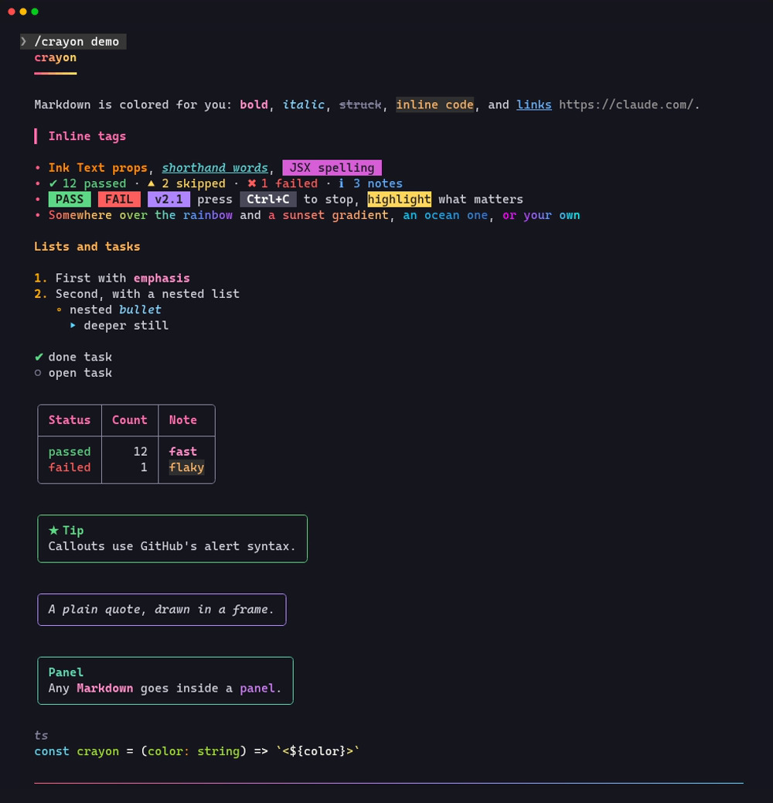
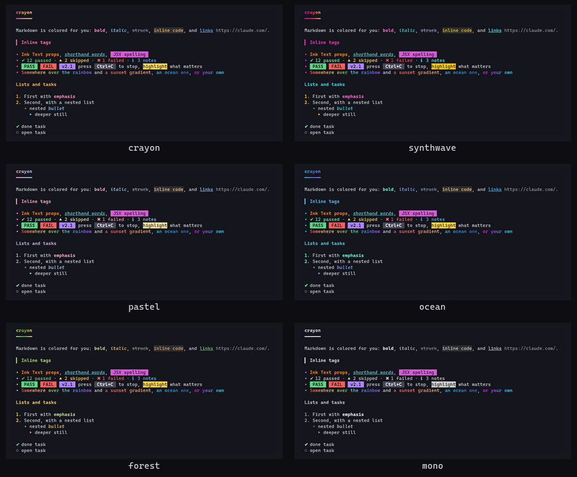

# crayon

**Colorful Claude Code replies.** crayon redraws every assistant reply with themed Markdown and teaches the model a small set of inline tags that render as real Ink `<Text>` styling: colors, bold, italic, badges, gradients, callouts and panels.


> [!NOTE]
> crayon is a **function-hooks plugin** (a "mod"). It needs **Claude Code 2.1.287 or newer**. The function-hooks API is in early access and may change between releases.

## Install

In Claude Code:

```
/plugin marketplace add jonpojonpo/cc-crayon
/plugin install crayon@cc-crayon
```

Or from a shell:

```sh
claude plugin marketplace add jonpojonpo/cc-crayon
claude plugin install crayon@cc-crayon
```

Restart Claude Code, then run `/crayon demo` to see everything at once.

To try it without installing, clone the repo and load it for one session:

```sh
git clone https://github.com/jonpojonpo/cc-crayon
claude --plugin-dir ./cc-crayon
```

## What you get



**Plain Markdown is colored automatically**, with no help from the model:

- H1 headings get a gradient and an underline, and H2s get a colored bar.
- **Bold**, *italic*, ~~strikethrough~~ and `code` each get their own color.
- List bullets change glyph and color by depth, and task items show ✔ or ○.
- Tables are drawn with rounded box lines and a colored header row.
- Quotes appear in a frame, and GitHub alerts (`> [!TIP]`, `> [!WARNING]`, …) become colored callout boxes.
- Horizontal rules are gradient lines, and code fences use Claude Code's own syntax highlighter.

**The model can also write inline tags.** crayon adds a short guide to the system prompt so the model knows them, and in practice it starts using them on its own:

| Write | Draws |
| --- | --- |
| `<t color="#ff8800" bold italic>…</t>` | Ink `Text` props: `color`, `bg`, `bold`, `italic`, `underline`, `strike`, `dim`, `inverse` |
| `<Text color="cyan" bold>…</Text>` | the same, in JSX spelling |
| `<t red bold>…</t>` | bare words as shorthand |
| `<orange>…</orange>` `<#ff5f87>…</>` | a named or hex color as a tag (`</>` closes the innermost tag) |
| `<bg navy>…</bg>` `<hl>…</hl>` | background color, or highlight |
| `<ok>` `<warn>` `<err>` `<info>` `<accent>` `<muted>` | colors that carry meaning and follow the theme |
| `<b>` `<i>` `<u>` `<s>` `<dim>` | style shorthands |
| `<badge green>PASS</badge>` | a solid label |
| `<kbd>Ctrl+C</kbd>` | a key cap |
| `<rainbow>…</rainbow>` | rainbow text |
| `<grad sunset>…</grad>` `<grad from="#f0f" to="#0ff">…</grad>` | a gradient, preset or your own stops |
| `<panel title="…" color="teal">` … `</panel>` (each tag on its own line) | a bordered box around any Markdown |

Named colors include the 16 ANSI names plus `orange pink hotpink purple violet lavender indigo teal mint lime emerald gold amber coral salmon peach rose crimson ruby sky azure navy brown silver`. Gradient presets: `sunset fire ocean aurora candy neon mint peach lava ice gold forest`.

Tags inside code spans and fences are left alone. Unknown tags such as `<div>` show as written, and an unclosed tag runs to the end of its paragraph instead of showing raw.

## Themes



## Commands

| Command | Does |
| --- | --- |
| `/crayon` | Shows the current settings and the themes |
| `/crayon demo` | Draws every feature once |
| `/crayon <theme>` | Switches theme: `crayon`, `synthwave`, `pastel`, `ocean`, `forest`, `mono` |
| `/crayon on` / `off` | Turns crayon's drawing on or off. When off, replies are drawn by Claude Code as usual |
| `/crayon dark` / `light` / `auto` | Forces a background. `auto` follows your `/config` theme |
| `/crayon teach on` / `off` | Adds or removes the tag guide in the system prompt |

Settings are saved across sessions, and changing the theme redraws earlier replies straight away.

## Good to know

- **Streaming.** While a reply streams in, Claude Code draws it with its own renderer. crayon strips the tags from those lines so they never flash on screen, and each block switches to full color when it finishes.
- **Tags stay in the transcript.** The saved message keeps the tags, so the ctrl+o transcript view shows them raw and the model sees them in its history. The guide tells the model never to put tags in code, files, tool inputs or commit messages.
- **System prompt cost.** The guide is about 550 tokens per session. Use `/crayon teach off` to drop it and keep only the automatic Markdown coloring. The guide is also left out of headless (`claude -p`) runs.
- **Fallbacks.** Replies longer than 30,000 characters and tables wider than the terminal are drawn by Claude Code's normal renderer.
- **Surfaces.** The tests draw the full demo on the terminal, desktop, VS Code and mobile surfaces.

## How it works

crayon is a single hooks module (`hooks/register.tsx`):

- a `ui.render` hook on `AssistantMessage` parses each reply (`hooks/parse.ts`) and draws it with the surface's own `Box`, `Text`, `Link` and `Code` elements (`hooks/render.tsx`);
- a `prompt.compose` hook adds the tag guide (`hooks/text.ts`) as a session-scoped system prompt section;
- a `classic.MessageDisplay` hook strips tags from lines as they stream and puts them back for the finished block;
- `/crayon` is a registered command whose output is drawn by crayon too.

Palettes live in `hooks/themes.ts`. Every color crayon hands the surface is a `#rrggbb` string, and on light backgrounds each one is darkened until it reads.

## Development

```sh
claude plugin validate .claude-plugin/plugin.json   # manifest + what the module hooks and calls
claude plugin test .                                # parser, render and prompt tests on every surface
claude --plugin-dir .                               # run it; saving a file hot-reloads the module
```

Once Claude Code has loaded the plugin from this folder, it writes the API types to `.claude-plugin/types/` (gitignored), and `tsc -p .` type-checks the module against them.

## License

[MIT](LICENSE)
